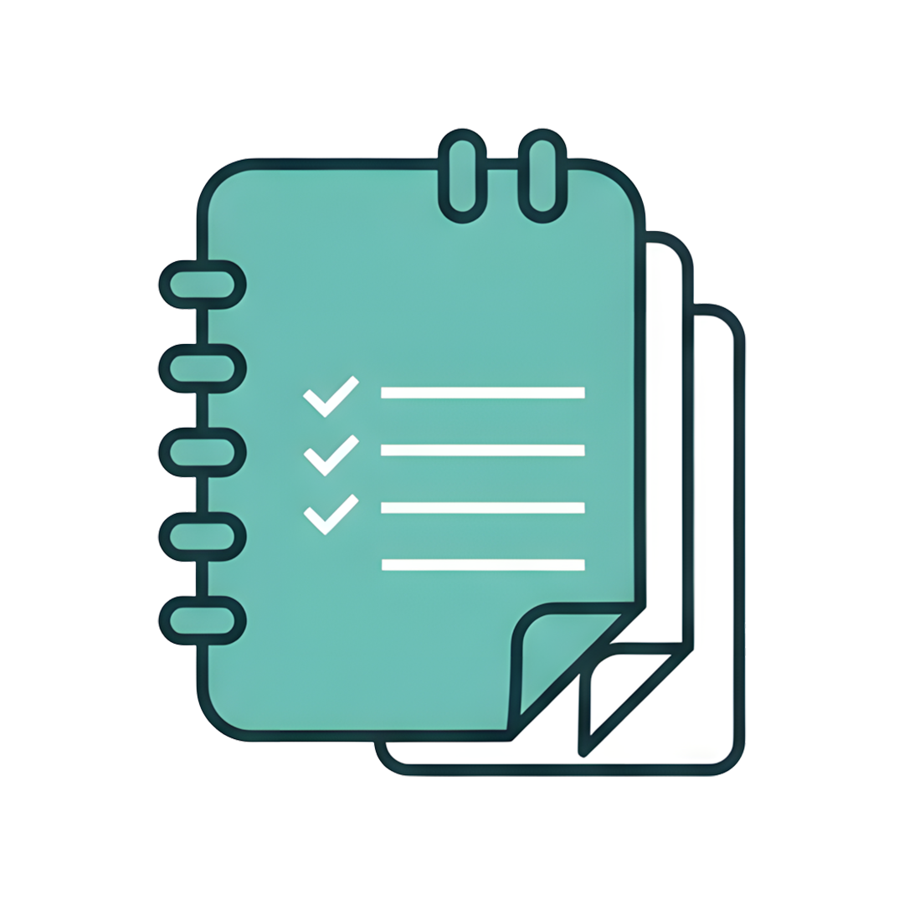

<p align="center">
  
</p>

<h1 align="center">Visit Log</h1>

<p align="center">
  <strong>سجل الزيارات</strong>
</p>

<p align="center">
  An offline-first Flutter app for education supervisors to record school visits<br>
  and produce the official monthly activity report in Arabic.
</p>

<p align="center">
  
  
  
  
  
</p>

---

## Overview

Visit Log replaces the paper logbook kept by school supervisors. The supervisor taps a day on the calendar, records which school was visited and under what activity type, and at the end of the month exports a report laid out to match the official form.

The interface is entirely Arabic with right-to-left layout. The app requires no account and no internet connection: every record is stored in a local database on the device.

## Features

**Visit records**
- Record a visit on any calendar day with school name, activity type, optional time, and notes
- Edit and delete existing records
- More than sixty predefined activity types covering supervision, committees, examinations, and training
- Fridays are treated as non-working days and are excluded from records and totals
- Official holidays, local holidays, and leave are tracked as distinct entry types

**Calendar**
- Monthly grid with Arabic month and day names
- Per-day indicators showing whether a record exists and how many
- Direct navigation between months

**Monthly report**
- Export to a self-contained HTML document sized for A4 portrait printing
- Layout matched to the official monthly activity form
- The report font is embedded directly in the file, so Arabic renders correctly on any machine that opens it, with no font installation
- Separate columns for activity details and notes
- Fridays and holiday entries are filtered out automatically
- Opens in a browser or Microsoft Word for printing and submission

**Backup**
- Full JSON export and import through the system file picker
- Import validates the file structure before replacing anything
- Reports and backups are written to the device Downloads folder

**Other**
- Daily reminder notification, suppressed on Fridays
- Light and dark themes

## Tech stack

| Area | Choice |
| --- | --- |
| Framework | Flutter |
| Language | Dart, SDK >= 3.0.0 |
| Local database | Hive with generated type adapters |
| Report output | Hand-built HTML and CSS with an embedded base64 font |
| Notifications | `flutter_local_notifications` with `timezone` and `flutter_timezone` |
| Files | `path_provider`, `file_picker` |
| Typography | Thmanyah Sans, bundled as a local asset |
| Localization | `flutter_localizations`, `intl` |
| iOS CI | Codemagic, see `codemagic.yaml` |

There are no networking dependencies. The app makes no HTTP requests.

## Project structure

```
lib/
├── main.dart                       App entry point, theming, Arabic localization
├── constants/
│   └── visit_types.dart            Predefined activity type list
├── models/
│   ├── visit.dart                  Visit model with Hive annotations
│   └── visit.g.dart                Generated Hive adapter
├── services/
│   ├── hive_service.dart           Database initialization and CRUD
│   ├── export_service.dart         Monthly HTML report generation
│   ├── backup_service.dart         JSON backup import and export
│   ├── notification_service.dart   Scheduled daily reminder
│   └── settings_service.dart       Persisted user preferences
├── screens/
│   ├── calendar_screen.dart        Main monthly calendar
│   ├── add_visit_page.dart         Create a record
│   ├── edit_visit_page.dart        Modify a record
│   ├── visit_details_page.dart     Read a record
│   └── settings_page.dart          Backup, restore, preferences
├── widgets/
│   └── day_tile.dart               Calendar day cell
└── assets/
    └── newlogo.png                 App icon source

assets/fonts/                       Thmanyah Sans, used by the UI and the report
test/                               Unit tests for export, backup, and storage
codemagic.yaml                      iOS CI pipeline
```

## Getting started

### Prerequisites

- Flutter SDK, latest stable channel
- Android Studio or VS Code with the Flutter extension
- An Android device or emulator, or an iOS device with a configured signing identity

### Setup

```bash
git clone https://github.com/tahakadhim00-afk/Visit-Log.git
cd Visit-Log
flutter pub get
dart run build_runner build --delete-conflicting-outputs
flutter run
```

The `build_runner` step regenerates `lib/models/visit.g.dart`, the Hive type adapter. It is required on a fresh clone.

### Tests

```bash
flutter test
```

### Regenerating launcher icons

```bash
dart run flutter_launcher_icons
```

### Release build

```bash
flutter build apk --release
```

Release builds are currently signed with the debug keystore, which Google Play will not accept. Before publishing, create a release keystore and reference it from a `signingConfig` in `android/app/build.gradle.kts`. Keystore files and `key.properties` are excluded by `.gitignore` and must never be committed.

For iOS, `codemagic.yaml` defines an unsigned workflow that builds without an Apple Developer account, and a signed release workflow that expects App Store Connect credentials to be supplied as Codemagic environment variables. No credentials are stored in this repository.

## Data and privacy

The app has no backend, no analytics, and no telemetry. Every record, preference, and setting is stored on the device in a local Hive database, and nothing is transmitted anywhere.

Data leaves the device only when the user deliberately exports a report or a backup, and those files are written to the local Downloads folder.

Because there is no cloud copy, uninstalling the app removes all records permanently. Take a JSON backup before changing devices.

## Localization

The interface is Arabic only, laid out right to left, with Arabic month and day names. The academic year is calculated from September rather than January, matching the school calendar.

## Roadmap

- Photo attachments for individual records
- Search and filtering across history
- Additional export formats
- Optional encrypted backup

## Author

Developed and maintained by **Taha Kadhim**.

Questions and suggestions: [tahakadhim00@gmail.com](mailto:tahakadhim00@gmail.com), or open an issue on this repository.

## License

Copyright (c) Taha Kadhim. All rights reserved.

The source is published for reference and educational purposes. Please contact the author for permission before redistributing it or using it commercially.

---

<div dir="rtl" align="right">

# سجل الزيارات

تطبيق للهواتف المحمولة مبني بـ Flutter، مخصص للمشرفين التربويين لتسجيل الزيارات المدرسية وإصدار جدول الأعمال الشهري باللغة العربية.

## نظرة عامة

صُمم التطبيق ليحل محل السجل الورقي. يختار المشرف اليوم من التقويم، ويسجل اسم المدرسة ونوع النشاط، ثم يصدّر في نهاية الشهر تقريرًا بتنسيق مطابق للاستمارة الرسمية.

الواجهة عربية بالكامل باتجاه من اليمين إلى اليسار. لا يحتاج التطبيق إلى حساب ولا إلى اتصال بالإنترنت، وتُحفظ جميع السجلات في قاعدة بيانات محلية على الجهاز.

## المزايا

**سجل الزيارات**
- تسجيل زيارة في أي يوم مع اسم المدرسة ونوع النشاط والوقت والملاحظات
- تعديل السجلات أو حذفها
- أكثر من ستين نوعًا معرفًا مسبقًا يشمل الإشراف واللجان والامتحانات والدورات
- تُعامل أيام الجمعة كعطلة ولا تُحتسب ضمن التقارير
- تمييز العطل الرسمية والمحلية والإجازات كأنواع مستقلة

**التقويم**
- عرض شهري بأسماء الأشهر والأيام بالعربية
- مؤشرات لكل يوم تبيّن وجود سجل وعدده
- تنقل مباشر بين الأشهر

**التقرير الشهري**
- تصدير مستند HTML مستقل مهيأ للطباعة بحجم A4 عمودي
- تنسيق مطابق لاستمارة جدول الأعمال الشهرية الرسمية
- تضمين خط التقرير داخل الملف نفسه، ليظهر النص العربي بشكل صحيح على أي جهاز دون الحاجة إلى تثبيت الخط
- عمودان منفصلان لتفاصيل النشاط وللملاحظات
- استبعاد أيام الجمعة والعطل تلقائيًا
- يمكن فتح التقرير في المتصفح أو في Microsoft Word لطباعته وتسليمه

**النسخ الاحتياطي**
- تصدير واستيراد كامل بصيغة JSON عبر مدير الملفات
- التحقق من صحة بنية الملف قبل الاستيراد
- تُحفظ التقارير والنسخ في مجلد التنزيلات

**مزايا أخرى**
- تذكير يومي بإشعار، ما عدا يوم الجمعة
- الوضع الفاتح والوضع الداكن

## التشغيل

```bash
git clone https://github.com/tahakadhim00-afk/Visit-Log.git
cd Visit-Log
flutter pub get
dart run build_runner build --delete-conflicting-outputs
flutter run
```

خطوة `build_runner` ضرورية عند أول نسخ للمشروع، إذ تولّد محوّل Hive الخاص بنموذج البيانات.

## الخصوصية

لا يحتوي التطبيق على خادم أو تحليلات أو أي اتصال بالشبكة. تُحفظ كل السجلات والإعدادات على الجهاز فقط ضمن قاعدة بيانات Hive محلية، ولا تُرسل أي بيانات إلى أي جهة.

لا تغادر البيانات الجهاز إلا عندما يصدّر المستخدم تقريرًا أو نسخة احتياطية بنفسه. وبما أنه لا توجد نسخة سحابية، فإن حذف التطبيق يؤدي إلى فقدان السجلات نهائيًا، لذا يُنصح بأخذ نسخة احتياطية قبل تغيير الجهاز.

## المطوّر

**طه كاظم**

للاستفسارات والمقترحات: [tahakadhim00@gmail.com](mailto:tahakadhim00@gmail.com)

## الترخيص

جميع الحقوق محفوظة. يُنشر المصدر لغرض الاطلاع والتعلم، ويُرجى مراجعة المطوّر قبل إعادة النشر أو الاستخدام التجاري.

</div>
